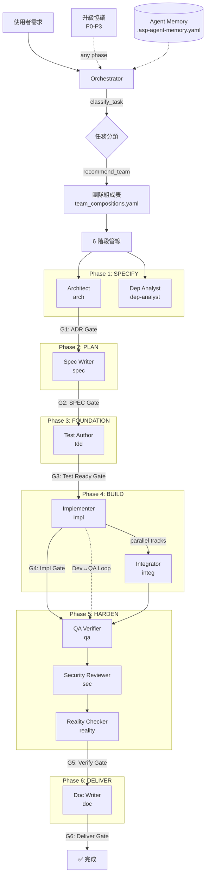
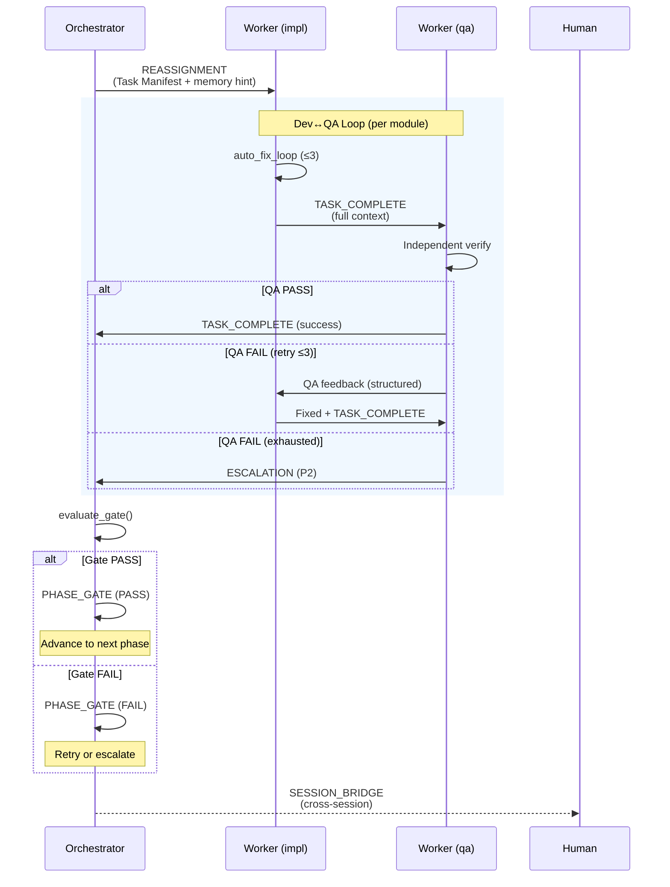
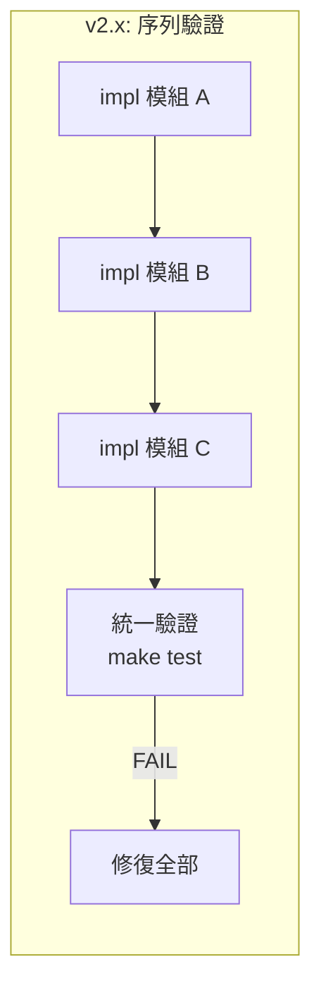
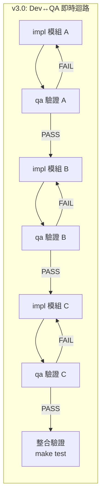
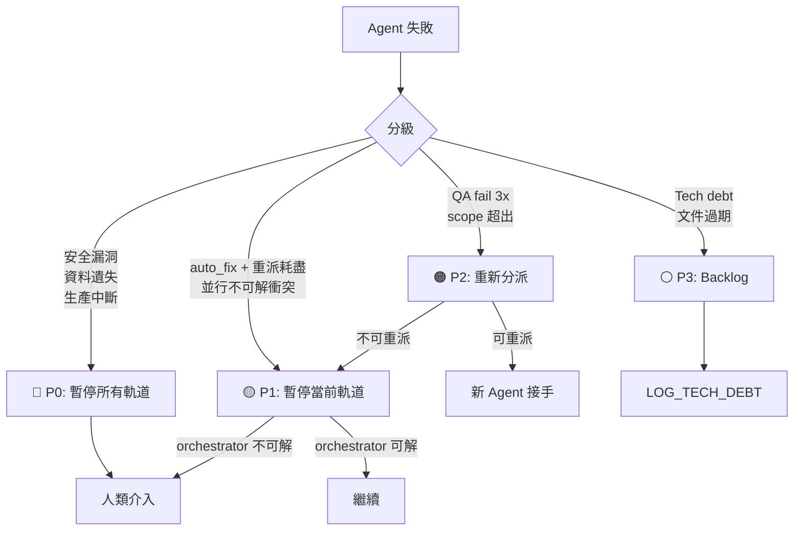
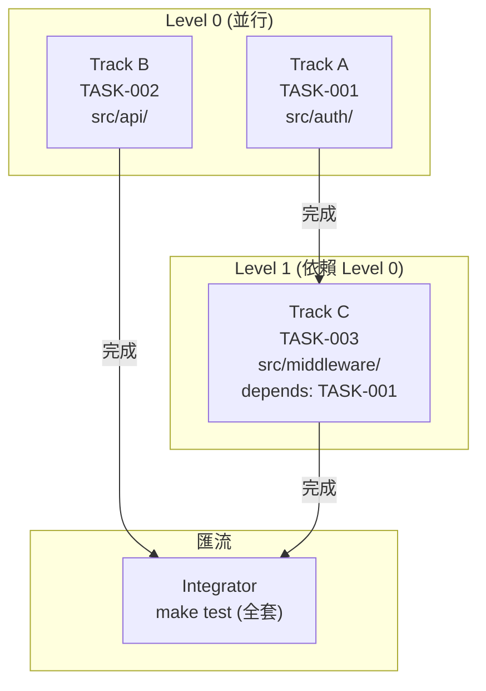

# Multi-Agent 協作架構（ASP v3.0）

> 本文件是 ASP v3.0 multi-agent 系統的完整技術參考。

---

## 1. 系統總覽

ASP v3.0 將 v2.x 的「Orchestrator + 通用 Worker」扁平模型升級為：
- **10 個專精角色**（4 部門）取代通用 Worker
- **6 階段品質管線** + 品質門
- **結構化交接協議**（5 種模板，context 全量傳遞）
- **Dev↔QA 即時迴路**（邊做邊驗）
- **P0-P3 升級協議**（分級路由）
- **Agent 記憶**（跨 session 學習）

### 系統架構圖



---

## 2. 角色部門表

### 4 部門、10 角色

| 部門 | 角色 | ID | 職責 | 立場 | 對應 Profile 函數 |
|------|------|-----|------|------|-----------------|
| **架構與規劃** | Architect | `arch` | ADR 建立、架構影響評估 | 中立 | `assess_architecture_impact()`, `committee_debate()` |
| | Spec Writer | `spec` | SPEC 七欄位撰寫 | 中立 | `execute_new_feature()` Phase 2 |
| | Dependency Analyst | `dep-analyst` | 依賴圖、並行標記、風險評分 | 中立 | `decompose()`, `analyze_requirement()` |
| **實作** | Test Author | `tdd` | TDD 測試撰寫（必須 FAIL） | 主動 | `execute_stage()` Step 3 |
| | Implementer | `impl` | 生產代碼（讓測試通過） | 主動 | `auto_fix_loop()`, `execute_stage()` Step 4 |
| | Integrator | `integ` | 跨模組整合、軌道匯流 | 中立 | `converge_tracks()` |
| **品質與驗證** | QA Verifier | `qa` | 獨立驗證、偷渡偵測 | 懷疑 | `on_worker_done()`, `dev_qa_loop()` |
| | Security Reviewer | `sec` | OWASP、憑證掃描、攻擊面 | 懷疑 | `committee_debate()` security 角色 |
| | Reality Checker | `reality` | **預設 NEEDS_WORK**、品質門否決權 | 懷疑 | `reality_check()` — v3.0 新增 |
| **文件** | Doc Writer | `doc` | CHANGELOG、README、SPEC 追溯 | 主動 | `documentation_pipeline()` |

> 角色定義檔案：`.asp/agents/{role-id}.yaml`

---

## 3. 交接協議

### 5 種交接模板



| 模板 | 用途 | 取代的舊機制 |
|------|------|-------------|
| **TASK_COMPLETE** | Worker → Orchestrator（完成/失敗） | `completed.jsonl` 3 欄位 |
| **REASSIGNMENT** | Orchestrator → 新 Worker（含前任完整診斷） | `reassign(context=failures)` 字串 |
| **ESCALATION** | 任何 agent → Orchestrator/人類（P0-P3） | `PAUSE_AND_REPORT()` |
| **PHASE_GATE** | 管線階段邊界（品質門結果） | **全新** |
| **SESSION_BRIDGE** | 跨 session（含 agent 狀態） | `.asp-autopilot-state.json` 單獨 |

> 模板定義：`.asp/templates/handoff/*.yaml`
>
> **關鍵設計**：Context 全量傳遞，不摘要。每份交接單包含完整測試輸出、完整 diff、完整 SPEC 引用。

---

## 4. 6 階段品質管線

### 管線流程

```
SPECIFY ──G1──▶ PLAN ──G2──▶ FOUNDATION ──G3──▶ BUILD ──G4──▶ HARDEN ──G5──▶ DELIVER ──G6──▶ DONE
```

### 階段 ↔ Agent ↔ Gate 映射

| 階段 | 主要 Agent | 品質門 | 門檻條件 |
|------|-----------|--------|---------|
| **SPECIFY** | arch, dep-analyst | G1: Architecture Gate | ADR Accepted + 依賴圖無環 |
| **PLAN** | spec, (reality) | G2: Specification Gate | SPEC 七欄位完整 + Done When 可二元測試 |
| **FOUNDATION** | tdd, (qa) | G3: Test Readiness Gate | 每個 Done When 有測試 + 測試全部 FAIL |
| **BUILD** | impl, (integ) | G4: Implementation Gate | `make test` PASS + `make lint` clean + scope 內 |
| **HARDEN** | qa, sec, reality | G5: Verification Gate | 獨立 QA + 安全審查 + 偷渡檢查 |
| **DELIVER** | doc, (reality) | G6: Delivery Gate | asp-ship 全綠 + 健康分數未退步 |

### Reality Checker 否決權

Reality Checker 參與 G2、G5、G6，擁有否決權：

- 預設判定 **NEEDS_WORK**
- 需要 ≥3 個正面證據 + 0 個反面證據才判定 READY
- 獨立執行 `make test`（不信任任何 agent 自我回報）

> 管線定義：`.asp/profiles/pipeline.md`
> Reality Checker 協議：`.asp/profiles/reality_checker.md`

---

## 5. Dev↔QA 即時迴路

### 從「做完再驗」到「邊做邊驗」





### 與 auto_fix_loop 的關係

| | auto_fix_loop | Dev↔QA Loop |
|---|---|---|
| 層級 | 低層（impl 內部） | 高層（impl + qa 協作） |
| 觸發者 | impl 自行跑測試 | qa 獨立驗證 |
| 信任模型 | impl 信任自己 | qa **不信任** impl |
| 防護 | 振盪/級聯/偷渡 | 偷渡 + 覆蓋率 + 獨立測試 |

> 定義：`.asp/profiles/dev_qa_loop.md`

---

## 6. 場景化團隊推薦

### 場景 → 團隊映射

| 場景 | 觸發條件 | 建議團隊 | 並行 |
|------|---------|---------|------|
| NEW_FEATURE_simple | 無架構影響、<5 檔案 | spec, tdd, impl, qa, doc | ✗ |
| NEW_FEATURE_complex | 有架構影響、>15 檔案 | 全部 10 角色 | ✓ |
| BUGFIX_trivial | 嚴重度 TRIVIAL | impl, qa | ✗ |
| BUGFIX_non_trivial | 嚴重度 ≥ NON_TRIVIAL | spec, tdd, impl, qa, doc | ✗ |
| BUGFIX_hotfix | 生產環境事故 | impl, qa, sec, doc | ✗ (auto-P0) |
| MODIFICATION_L1_L2 | L1 細節 / L2 SPEC 推翻 | spec, tdd, impl, qa, doc | ✗ |
| MODIFICATION_L3_L4 | L3 ADR 推翻 / L4 方向 Pivot | 全部 10 角色 | ✓ |
| REMOVAL | 安全移除 | dep-analyst, impl, qa, reality, doc | ✗ |

### 動態調整

| 事件 | 追加角色 |
|------|---------|
| auto_fix 耗盡 | + sec |
| scope 超出 | + arch |
| 安全發現 | + sec（如果不在） |
| 並行衝突 | + integ |

> 定義：`.asp/agents/team_compositions.yaml`

---

## 7. 升級協議（P0-P3）

### 嚴重度路由



### 觸發來源

| 來源 | 原有機制 | v3.0 升級路由 |
|------|---------|-------------|
| 振盪偵測 | PAUSE_AND_REPORT | escalate(P2) |
| 級聯偵測 | PAUSE_AND_REPORT | escalate(P2) |
| 偷渡偵測 | PAUSE_AND_REPORT | escalate(P1) |
| 重試耗盡 | escalate_to_human | escalate(P2→P1) |
| 安全漏洞 | （無） | escalate(P0) |
| 品質門失敗 | （無） | escalate(P2) |

> 定義：`.asp/profiles/escalation.md`

---

## 8. 並行執行

### 拓撲排序 + 多軌規劃



### 增強檔案鎖定

```yaml
# .agent-lock.yaml v3.0 格式
locked_files:
  src/auth/handler.go:
    by: impl-1
    task: TASK-001
    track: A              # 新增：軌道標識
    level: 0              # 新增：拓撲層級
    lock_type: exclusive  # 新增：exclusive | shared-read
    since: 2026-03-24T10:00:00Z
    expires: 2026-03-24T12:00:00Z
```

---

## 9. Agent 記憶

### 兩層記憶架構

| 層級 | 儲存位置 | 生命週期 | 用途 |
|------|----------|----------|------|
| Session Memory | `.asp-agent-session.json` | 單一 session | agent 分派、軌道、交接單 |
| Project Memory | `.asp-agent-memory.yaml` | 永久（90 天修剪） | 修復策略、團隊效能、失敗模式 |

### Reassignment 時的記憶查詢

Orchestrator 重派 Worker 時，自動查詢 Project Memory：
1. 搜尋匹配的修復策略
2. 按成功率排序
3. 寫入 REASSIGNMENT 交接單的 `memory_ref` 欄位

> 定義：`.asp/profiles/agent_memory.md`

---

## 10. 根因領域偵測（v3.1）

Bug 修復時，AI 自動偵測問題的根因領域，據此追加專精角色：

| 領域 | 偵測信號 | 追加角色 | 特殊行為 |
|------|---------|---------|---------|
| auth | auth/, permission/, login, JWT 等 | + sec | — |
| concurrency | race, deadlock, cache, queue 等 | + dep-analyst | — |
| data_integrity | schema, migration, model/ 等 | — | 強制全量測試 |
| api_contract | API, response, handler/ 等 | + sec, dep-analyst | — |
| state_machine | state, transition, FSM 等 | — | 強制 state scan |
| boundary | edge case, overflow, off-by-one 等 | — | 擴大 grep 範圍 |
| null_safety | null, nil, undefined 等 | — | 掃描 nullable 存取 |

> 使用者不需要手動指定領域——AI 從 bug 描述、錯誤訊息、檔案路徑自動推斷。

---

## 11. Agent Memory 主動檢查（v3.1）

修復 bug 之前，AI 自動查詢歷史記憶：

```
Bug 進來 → 偵測領域 → 查詢記憶 → 修復前
                         ↓
              ⚠️ "src/auth/ 歷史上 null_check 出現 5 次"
              💡 "建議策略：Add null guard（成功率 75%）"
              📊 "加入 sec 角色後成功率更高"
              🔍 "修復前掃描：grep -rn nil src/auth/"
```

記憶格式（v3.1 升級）：
- `fix_strategies` 新增 `domain`、`root_cause_class`、`recommended_agents` 欄位
- `common_failures` 新增 `domain` 欄位
- `team_effectiveness` 新增 `domains_encountered` 欄位

> 定義：`.asp/profiles/agent_memory.md`（`proactive_memory_check()` 函數）

---

## 12. Gherkin 驗收場景（v3.2）

非 trivial 的 SPEC 必須包含測試矩陣和 Gherkin 場景：

```
SPEC
├─ 測試矩陣（正向 P / 負向 N / 邊界 B）
│   └─ 每行對應一個場景 ID
├─ 驗收場景（Gherkin Feature）
│   ├─ Scenario: S1 - 正向...
│   ├─ Scenario: S2 - 負向...
│   └─ Scenario Outline: S3 - 邊界...
└─ Done When
    └─ 引用場景總數 + make test 通過
```

### 流程

```
測試矩陣 → Gherkin 場景 → 測試骨架（AI 自動產生）→ 實作 → 品質門驗證
```

### 品質門整合

- **G2 Gate**：強制驗證矩陣存在（P≥1, N≥1）+ 場景存在 + 場景品質（非敷衍）
- **G3 Gate**：每個場景有對應測試 + 測試數 ≥ 場景數 + 測試全部 FAIL

### 豁免

- trivial（≤2 檔 + ≤10 行 + 無邏輯變更）：全豁免
- config-only（純設定檔變更）：場景豁免，矩陣仍需要

---

## 13. Makefile 指令速查

| 指令 | 說明 |
|------|------|
| `make agent-handoff-list` | 列出所有交接單 |
| `make agent-handoff-view ID=...` | 檢視單一交接單 |
| `make agent-tracks` | 顯示當前並行軌道 |
| `make agent-track-status TRACK=A` | 特定軌道詳情 |
| `make agent-escalation-log` | 升級歷史 |
| `make agent-memory-show` | 顯示 project memory |
| `make agent-memory-prune AGE=90` | 修剪過期記憶 |
| `make agent-team-recommend TYPE=...` | 團隊推薦 |

---

## 14. 檔案結構

```
.asp/
├── agents/                         # 角色定義
│   ├── arch.yaml
│   ├── spec.yaml
│   ├── dep-analyst.yaml
│   ├── tdd.yaml
│   ├── impl.yaml
│   ├── integ.yaml
│   ├── qa.yaml
│   ├── sec.yaml
│   ├── reality.yaml
│   ├── doc.yaml
│   └── team_compositions.yaml      # 場景團隊表
├── profiles/
│   ├── multi_agent.md              # 核心協調（v3.0 升級）
│   ├── pipeline.md                 # 6 階段管線 + 品質門
│   ├── reality_checker.md          # 懷疑主義驗證
│   ├── dev_qa_loop.md              # 即時品質迴路
│   ├── escalation.md               # P0-P3 升級
│   └── agent_memory.md             # Agent 學習記憶
├── templates/
│   ├── handoff/                    # 5 種交接模板
│   │   ├── TASK_COMPLETE.yaml
│   │   ├── REASSIGNMENT.yaml
│   │   ├── ESCALATION.yaml
│   │   ├── PHASE_GATE.yaml
│   │   └── SESSION_BRIDGE.yaml
│   └── gate_report.md             # 品質門報告模板
└── ...

.claude/skills/asp/
├── SKILL.md                        # 路由表（10 個 skill）
├── asp-dispatch.md                 # 任務分派
├── asp-qa.md                       # QA 驗證
├── asp-security.md                 # 安全審查
├── asp-reality-check.md            # 懷疑主義驗收
├── asp-impact.md                   # 影響分析
└── ... (原有 5 個 skill)

# 執行時期狀態檔案（.gitignore）
.asp-agent-memory.yaml              # Project Memory
.asp-agent-session.json             # Session Memory
.agent-events/handoffs/             # 交接單存放
```

---

## 15. 向後相容

| 場景 | 行為 |
|------|------|
| `mode: auto` (預設) | AI 自動判斷是否需要 multi-agent，按需動態載入 profiles |
| `mode: single` | 所有角色由同一 agent 扮演，管線仍執行但無交接單 |
| `mode: multi-agent` (v2.x 配置) | 新增欄位為 optional，`.agent-lock.yaml` 向後相容 |
| 無 `team_compositions.yaml` | fallback 到 v2.x 的通用 Worker 分派 |
| 無 `escalation.md` | fallback 到 PAUSE_AND_REPORT |

---

*ASP v3.0 — Multi-Agent Collaboration Architecture*
